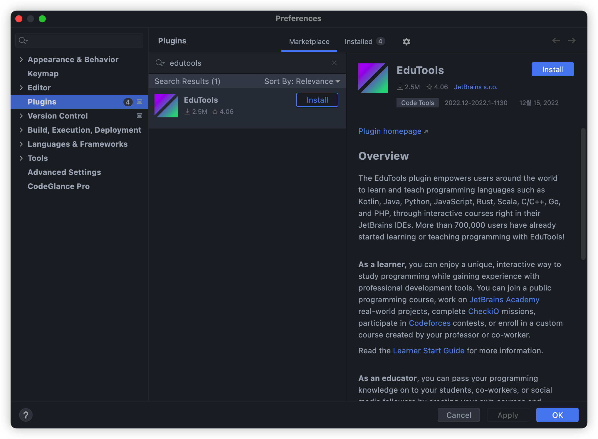
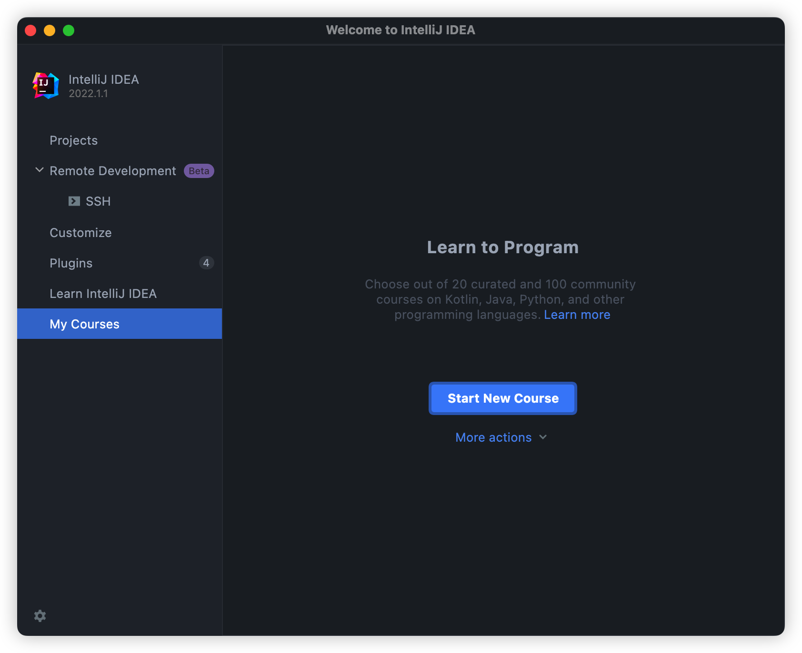
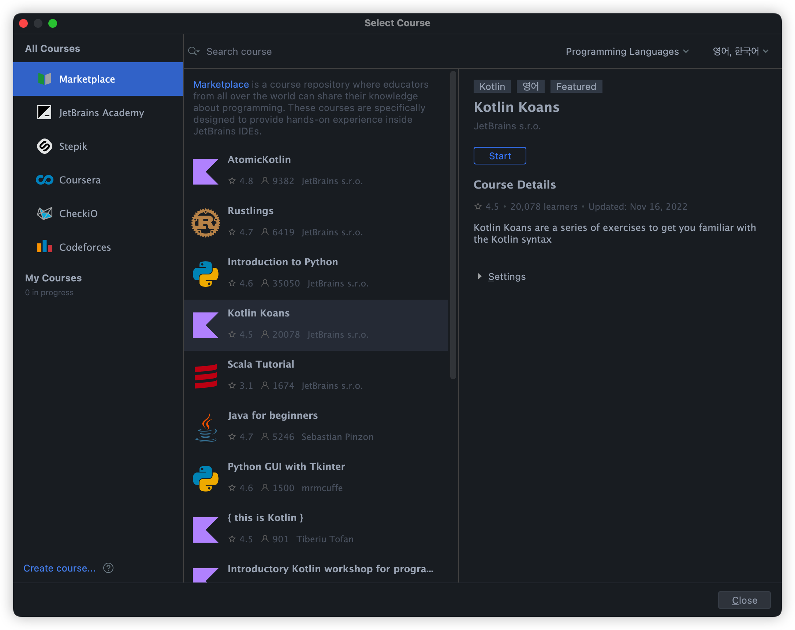
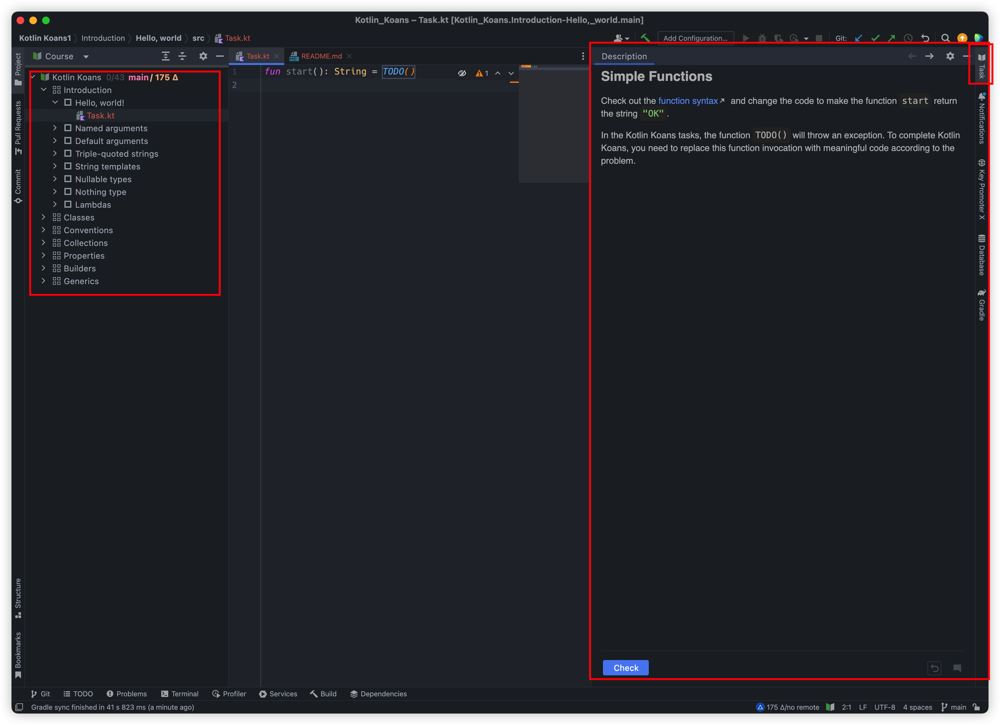

# How to Use

Jetbrain 에서 제공하는 [Leaner start guid](https://plugins.jetbrains.com/plugin/10081-edutools/docs/learner-start-guide.html) 를 참고해서 진행할 수 있습니다.

 

## 1. Edutools Plugin 설치

IntelliJ Plugin 에서 Edutools 를 다운받습니다.

 

## 2. Course 열기

IntelliJ 초기 화면으로 이동해서 Start New Course 를 선택합니다.

 

## 3. Kotlin Koans 시작

Kotlin Koans 를 찾아서 Start 버튼을 누르면 시작됩니다.

처음 실행할 때는 시간이 좀 오래걸릴 수 있습니다.

 

## 4. Task 실행

Description 을 보고 요구사항에 맞춰 코드를 작성하면 됩니다.

Check 버튼을 누르면 맞틀 여부를 알려주며 틀린 경우 Peek Solution 으로 답을 확인할 수 있습니다.

